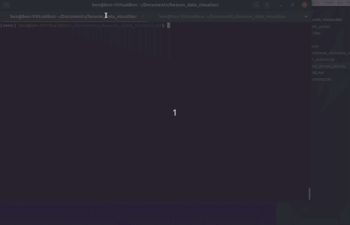

# beacon_data_visualizer

## Installation: (for Python 3.8.5)
1. git clone https://github.com/benmp2/beacon_data_visualizer
2. cd beacon_data_visualizer
3. pip install --upgrade pip
4. pip install virtualenv
5. python -m venv venv
6. source venv/bin/activate
7. pip install -r requirements.txt  
(step 7 might fail, make sure you have the most recent mono installed: https://www.mono-project.com/download/stable/)

## Usage:
1. Turn on bluetooth on laptop.
2. Have an estimote beacon nearby.
3. run 'bokeh serve'
4. run 'python estimote_stream_plot.py' 

## Tutorial:
