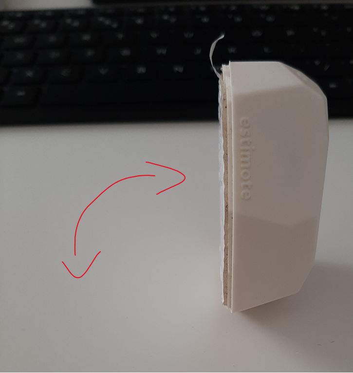

# beacon_data_visualizer
   A simple project for visualizing [Estimote](https://estimote.com/) beacon 3-axis accelerometer data. 
For capturing the accelerometer data packets I used [bleak](https://bleak.readthedocs.io/en/latest/) was used.
For visualizing the data strem I went with [bokeh](https://bokeh.org/).
It is possible to run the code on Windows 10 however I found that running it on linux (ubuntu in a VM) gave better results, i.e. more data packets got captured.
This is most likely down to how the Bluetooth LE scan interval and time is configured differently on the two different operating systems.
The beacon sends accelerometer data every 200ms. Docker containerization of the project was not an option as the bluetooth hardware is not available from inside of a container.

## Installation: (for Python 3.8.5)
1. git clone https://github.com/benmp2/beacon_data_visualizer
2. cd beacon_data_visualizer
3. pip install --upgrade pip
4. pip install virtualenv
5. python -m venv venv
6. source venv/bin/activate
7. pip install -r requirements.txt  
(step 7 might fail, make sure you have the most recent mono installed: https://www.mono-project.com/download/stable/)

## Usage:
1. Turn on bluetooth on laptop.
2. Have an estimote beacon nearby.
3. run 'bokeh serve'
4. run 'python estimote_stream_plot.py' 

## Tutorial:
    
  
   During the recording the beacon was being flipped between 0 and 90 degrees. This resulted in a square wave like acceleration profile along the y and the z axis. 
This was because of how the two axes aligned in each flipped position with the Earth's gravitational field. The mhp chart can be thought of as a gravity-free linear acceleration value. Essentially a high-pass filtered magnitude version of the measuresed signals along the 3-axis.  
  
  
